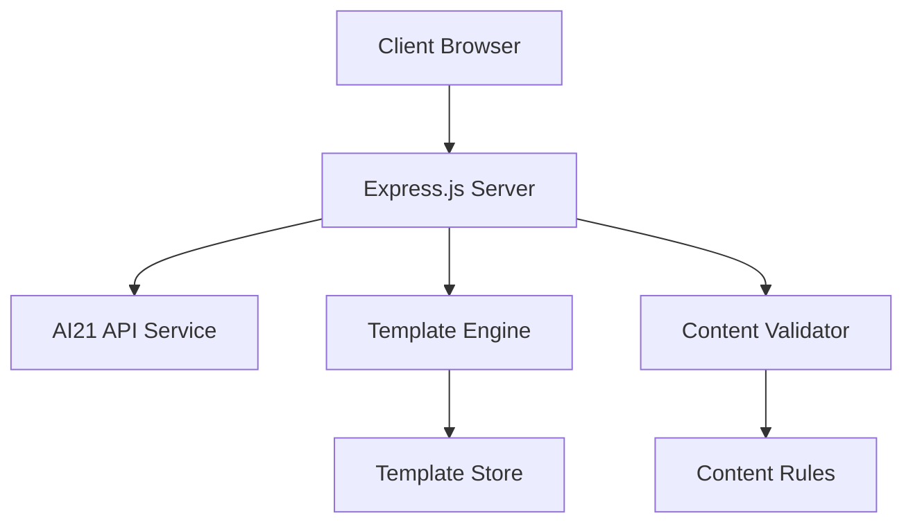

# AI Marketing Copy Generator - Technical Documentation

## Table of Contents

1. [System Architecture](#system-architecture)
2. [Implementation Details](#implementation-details)
3. [Deployment Guide](#deployment-guide)

## System Architecture

### Overview

The AI Marketing Copy Generator is built on a modern web stack with the following key components:



### Core Components

1. **Frontend Layer**
   - HTML5/CSS3 with modern features
   - Vanilla JavaScript (ES6+)
   - Responsive design system
   - Theme management
   - Client-side validation

2. **Backend Layer**
   - Express.js server
   - RESTful API endpoints
   - Rate limiting
   - Error handling
   - Logging system

3. **AI Integration Layer**
   - AI21 Jurassic-2 model
   - Prompt management
   - Response processing
   - Error recovery

4. **Data Layer**
   - Template storage
   - Usage statistics
   - Cache management
   - Session handling

### System Requirements

- Node.js 14.x or higher
- NPM 6.x or higher
- 2GB RAM minimum
- 1GB storage space
- Internet connectivity for AI21 API

## Implementation Details

### Frontend Implementation

#### Core Modules

1. **Template Manager (`public/scripts/templates.js`)**
```javascript
class TemplateManager {
    constructor() {
        this.templates = new Map();
        this.activeTemplate = null;
    }

    async loadTemplate(id) {
        const response = await fetch(`/api/templates/${id}`);
        const template = await response.json();
        this.templates.set(id, template);
        return template;
    }

    setActiveTemplate(id) {
        this.activeTemplate = this.templates.get(id);
        this.emit('template-changed', this.activeTemplate);
    }
}
```

2. **Validation Service (`public/scripts/validation.js`)**
```javascript
class ValidationService {
    static validateInput(text) {
        if (text.length < 10) {
            throw new Error('Input too short');
        }
        
        const forbiddenChars = /[<>\[\]{}]/g;
        if (forbiddenChars.test(text)) {
            throw new Error('Invalid characters detected');
        }
        
        return true;
    }
}
```

3. **UI Controller (`public/scripts/ui.js`)**
```javascript
class UIController {
    constructor() {
        this.editor = document.querySelector('#editor');
        this.output = document.querySelector('#output');
        this.setupEventListeners();
    }

    setupEventListeners() {
        this.editor.addEventListener('input', this.handleInput.bind(this));
        this.editor.addEventListener('focus', this.handleFocus.bind(this));
    }

    showError(message) {
        const toast = new Toast({
            message,
            type: 'error',
            duration: 3000
        });
        toast.show();
    }
}
```

### Backend Implementation

#### API Endpoints

1. **Generate Content (`/api/generate`)**
```javascript
app.post('/api/generate', async (req, res) => {
    try {
        const { prompt, template, tone } = req.body;
        
        // Validate input
        if (!ValidationService.validateInput(prompt)) {
            throw new Error('Invalid input');
        }
        
        // Generate content
        const content = await AI21Service.generate({
            prompt,
            template,
            tone,
            maxTokens: 500
        });
        
        res.json({ content });
    } catch (error) {
        res.status(400).json({ error: error.message });
    }
});
```

2. **Template Management (`/api/templates`)**
```javascript
app.get('/api/templates', (req, res) => {
    const templates = TemplateStore.getAll();
    res.json({ templates });
});

app.get('/api/templates/:id', (req, res) => {
    const template = TemplateStore.get(req.params.id);
    if (!template) {
        return res.status(404).json({ error: 'Template not found' });
    }
    res.json(template);
});
```

### AI21 Integration

```javascript
class AI21Service {
    constructor(apiKey) {
        this.apiKey = apiKey;
        this.baseUrl = 'https://api.ai21.com/studio/v1';
    }

    async generate(params) {
        const response = await fetch(`${this.baseUrl}/j2-large/complete`, {
            method: 'POST',
            headers: {
                'Authorization': `Bearer ${this.apiKey}`,
                'Content-Type': 'application/json'
            },
            body: JSON.stringify({
                prompt: params.prompt,
                maxTokens: params.maxTokens,
                temperature: 0.7,
                topP: 0.9,
                stopSequences: ["\n\n", "###"]
            })
        });

        if (!response.ok) {
            throw new Error('AI21 API error');
        }

        return response.json();
    }
}
```

## Deployment Guide

### Local Development Setup

1. **Clone Repository**
```bash
git clone https://github.com/yourusername/marketing-generator.git
cd marketing-generator
```

2. **Install Dependencies**
```bash
npm install
```

3. **Configure Environment**
```bash
cp example.env .env
# Edit .env with your AI21 API key
```

4. **Start Development Server**
```bash
npm run dev
```

### Production Deployment

1. **Build Process**
```bash
npm run build
```

2. **Server Configuration**
- Node.js environment setup
- Reverse proxy configuration
- SSL certificate installation
- Environment variables configuration

3. **Deployment Steps**
```bash
# Install PM2 globally
npm install -m2 -g

# Start the application
pm2 start ecosystem.config.js

# Save PM2 process list
pm2 save

# Setup startup script
pm2 startup
```

### Monitoring and Maintenance

1. **Health Checks**
```javascript
app.get('/health', (req, res) => {
    const health = {
        uptime: process.uptime(),
        timestamp: Date.now(),
        status: 'OK'
    };
    res.json(health);
});
```

2. **Error Tracking**
```javascript
app.use((err, req, res, next) => {
    console.error(err.stack);
    res.status(500).json({
        error: 'Internal server error',
        requestId: req.id
    });
});
```

3. **Performance Monitoring**
```javascript
const responseTime = require('response-time');

app.use(responseTime((req, res, time) => {
    metrics.timing('api.response_time', time);
}));
```

### Security Considerations

1. **API Key Management**
- Store keys in environment variables
- Rotate keys regularly
- Implement key encryption at rest

2. **Input Validation**
- Sanitize all user inputs
- Validate request parameters
- Implement rate limiting

3. **Error Handling**
- Hide internal error details
- Log errors securely
- Implement graceful degradation

### Scaling Considerations

1. **Horizontal Scaling**
- Stateless application design
- Load balancer configuration
- Session management

2. **Caching Strategy**
- Response caching
- Template caching
- Rate limit caching

3. **Database Scaling**
- Connection pooling
- Query optimization
- Indexing strategy 